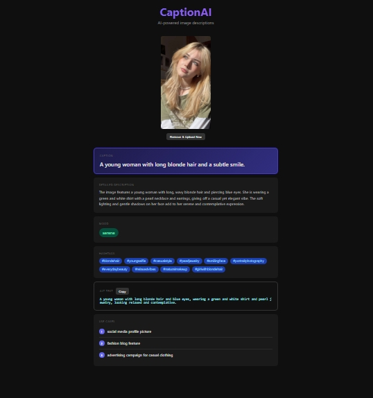

# CaptionAI

AI-powered image captioning web application using Groq's vision models. Generate professional captions, hashtags, alt text, and more from any image.

 

## Features

- **Drag & Drop Upload** - Easy image upload with preview
- **AI-Powered Analysis** - Generate captions using Groq's LLaVA vision model
- **Multi-Language Support** - English hashtags and descriptions
- **Accessibility** - Auto-generated alt text for images
- **One-Click Copy** - Copy hashtags and alt text instantly
- **Dark Mode UI** - Modern, eye-friendly interface

## Demo



## Quick Start

### Prerequisites

- Python 3.11+
- Groq API Key ([Get one here](https://console.groq.com/))

### Installation

```bash
# Clone the repository
git clone https://github.com/YOUR_USERNAME/CaptionAI.git
cd CaptionAI

# Create virtual environment
python -m venv venv
venv\Scripts\activate  # Windows
source venv/bin/activate  # Linux/Mac

# Install dependencies
pip install -r requirements.txt

# Setup environment
copy .env.example .env
# Edit .env and add your GROQ_API_KEY

# Run the app
python app.py
```

Open http://localhost:5000 in your browser.

### Docker

```bash
docker-compose up --build
```

## API Usage

### POST /api/v1/caption

Upload an image to generate AI caption.

```bash
curl -X POST http://localhost:5000/api/v1/caption \
  -F "image=@image.jpg"
```

**Response:**
```json
{
  "result": "{\n  \"caption\": \"A beautiful sunset over the ocean\",\n  \"detailed_description\": \"...\",\n  \"hashtags\": [\"sunset\", \"ocean\", ...],\n  \"alt_text\": \"...\",\n  \"mood\": \"serene\",\n  \"use_cases\": [\"social media\", ...]\n}"
}
```

## Tech Stack

- **Backend**: Flask 3.0
- **AI**: Groq LLaVA Vision
- **Frontend**: Vanilla HTML/CSS/JS
- **Validation**: Pydantic, Marshmallow
- **Testing**: Pytest

## Project Structure

```
CaptionAI/
├── app.py                 # Entry point
├── backend/
│   ├── app.py            # Flask factory
│   ├── config/           # Settings
│   ├── exceptions.py     # Custom exceptions
│   ├── routes/           # API routes
│   ├── schemas/          # Validation
│   ├── security/         # Security headers
│   ├── services/         # AI service
│   └── utils/            # Logger
├── templates/            # HTML frontend
├── tests/                # Unit tests
├── Dockerfile
├── docker-compose.yml
└── requirements.txt
```

## Configuration

| Variable | Description | Default |
|----------|-------------|---------|
| GROQ_API_KEY | Groq API key | Required |
| DEBUG | Debug mode | false |
| MAX_FILE_SIZE_MB | Max upload size | 5 |

## Contributing

1. Fork the repository
2. Create your feature branch (`git checkout -b feature/amazing-feature`)
3. Commit your changes (`git commit -m 'Add some amazing feature'`)
4. Push to the branch (`git push origin feature/amazing-feature`)
5. Open a Pull Request

## License

MIT License - see [LICENSE](LICENSE) for details.

---

Made with ❤️ using Groq API